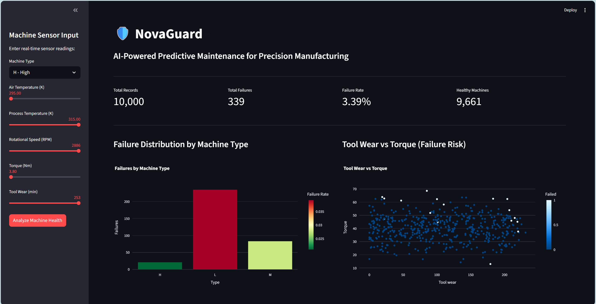
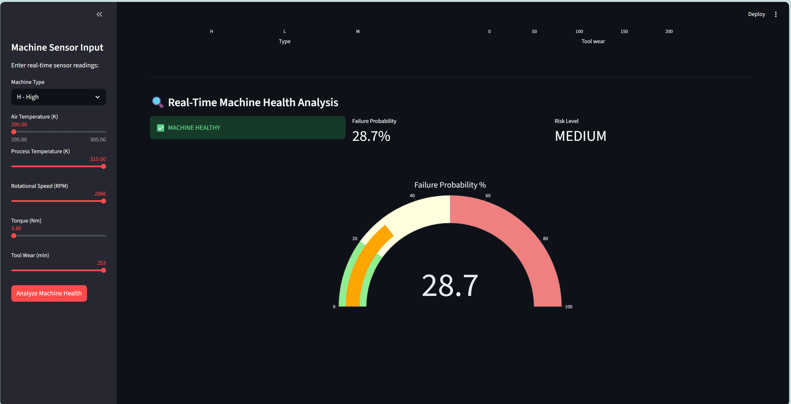

# 🛡️ NovaGuard
### AI-Powered Predictive Maintenance for Precision Manufacturing

NovaGuard is a machine learning dashboard that predicts equipment failures in real-time using sensor data from manufacturing machines. Built to help factory floor managers take action before machines break down.

---

## 🚨 The Problem
Manufacturing companies lose millions every year due to unexpected machine failures. Traditional maintenance is either:
- **Reactive** — fix it after it breaks (costly downtime)
- **Scheduled** — fix it on a calendar (wasteful)

NovaGuard enables **Predictive Maintenance** — fix it only when the data says it needs it.

---

## ✅ Solution
NovaGuard analyzes 5 real-time sensor readings and predicts failure probability using an XGBoost ML model trained on 10,000 industrial data points.

---

## 🖥️ Dashboard Preview

### Main Dashboard


### Real-Time Health Analysis


---

## 🔧 Features
- Real-time machine health prediction (Healthy / At Risk)
- Failure probability gauge (0-100%)
- Risk level classification (LOW / MEDIUM / HIGH)
- Failure distribution by machine type
- Tool wear vs torque failure risk scatter plot
- Interactive sensor input sliders

---

## 🧠 ML Model
- **Algorithm:** XGBoost Classifier
- **Dataset:** AI4I 2020 Predictive Maintenance Dataset (UCI ML Repository)
- **Training Data:** 10,000 industrial sensor readings
- **Overall Accuracy:** 97%
- **Failure Recall:** 82%
- **Features:** Machine Type, Air Temperature, Process Temperature, Rotational Speed, Torque, Tool Wear

---

## 🛠️ Tech Stack
| Layer | Technology |
|---|---|
| Frontend | Streamlit |
| ML Model | XGBoost, Scikit-learn |
| Data Processing | Pandas, NumPy |
| Visualization | Plotly, Matplotlib, Seaborn |
| Dataset | UCI AI4I 2020 |

---

## 🚀 How to Run

**1. Clone the repository**
```bash
git clone https://github.com/yourusername/NovaGuard.git
cd NovaGuard
```

**2. Create virtual environment**
```bash
python -m venv venv
venv\Scripts\activate
```

**3. Install dependencies**
```bash
pip install -r requirements.txt
```

**4. Train the model**
```bash
python train_model.py
```

**5. Run the dashboard**
```bash
streamlit run app.py
```

---

## 📊 Dataset
AI4I 2020 Predictive Maintenance Dataset from UCI ML Repository.
- 10,000 data points
- 5 sensor features
- Binary failure classification
- Synthetic dataset reflecting real industrial data

---

## 👨‍💻 Author
**Yogananda Manjunath**
MS Data Science, University of New Haven — May 2026
[LinkedIn](https://www.linkedin.com/in/yogananda-manjunath-827113227/)